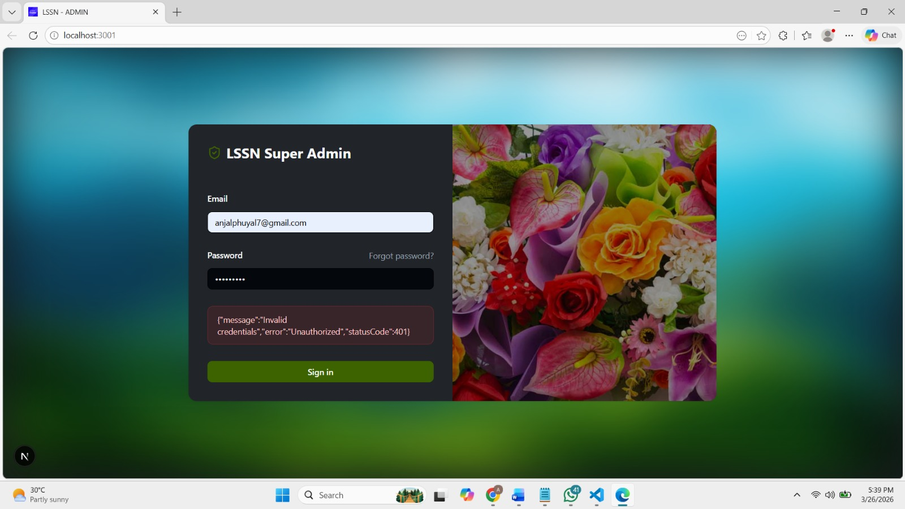
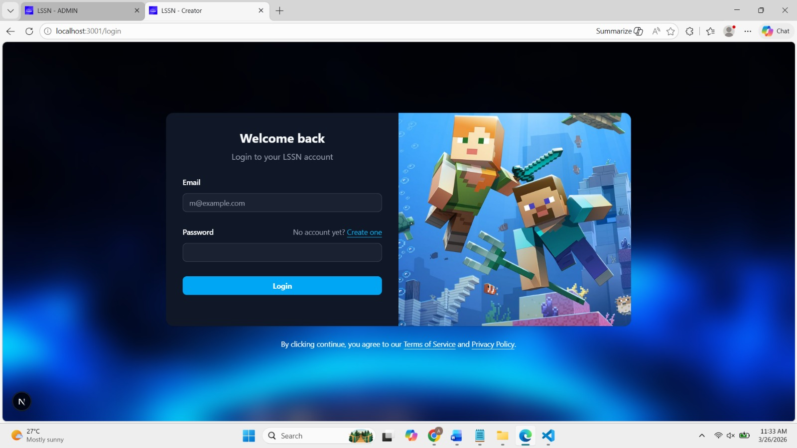
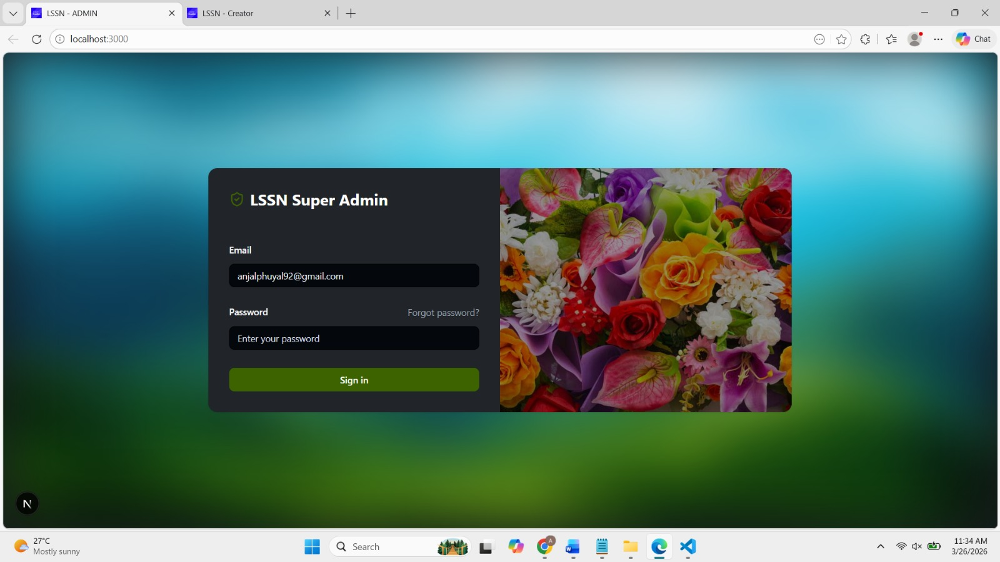
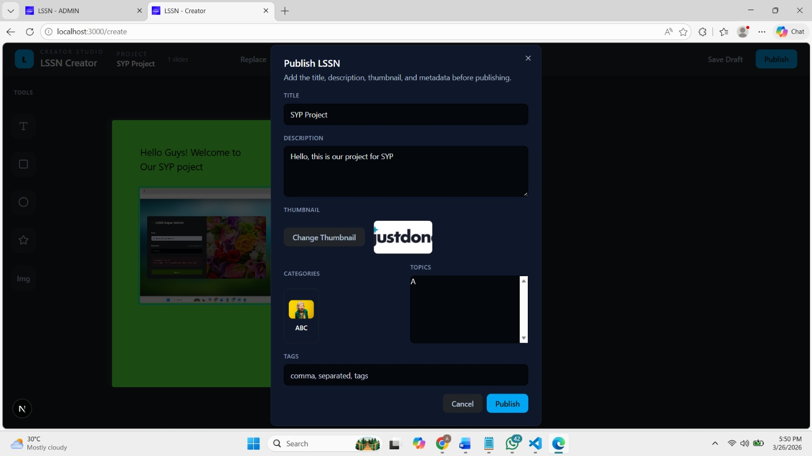
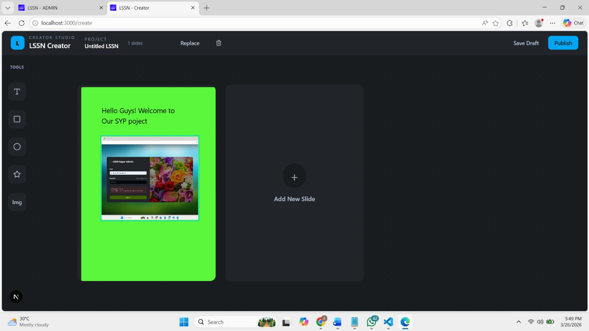
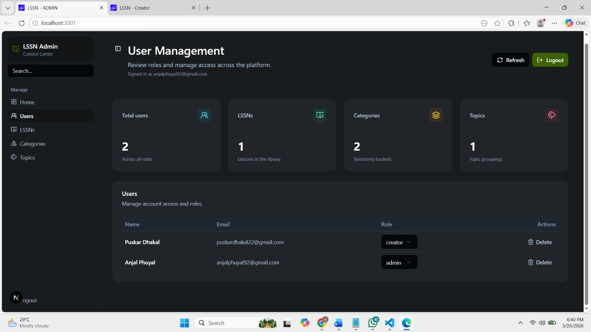
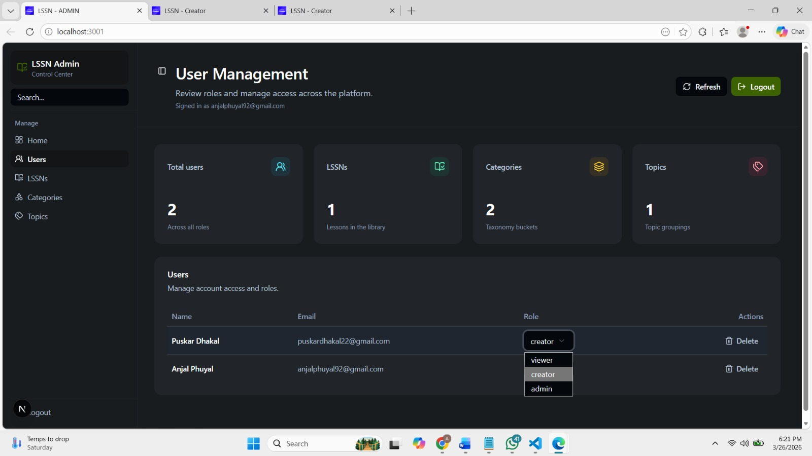
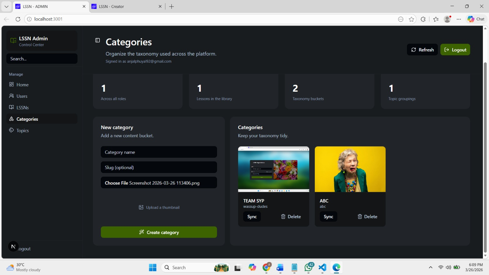
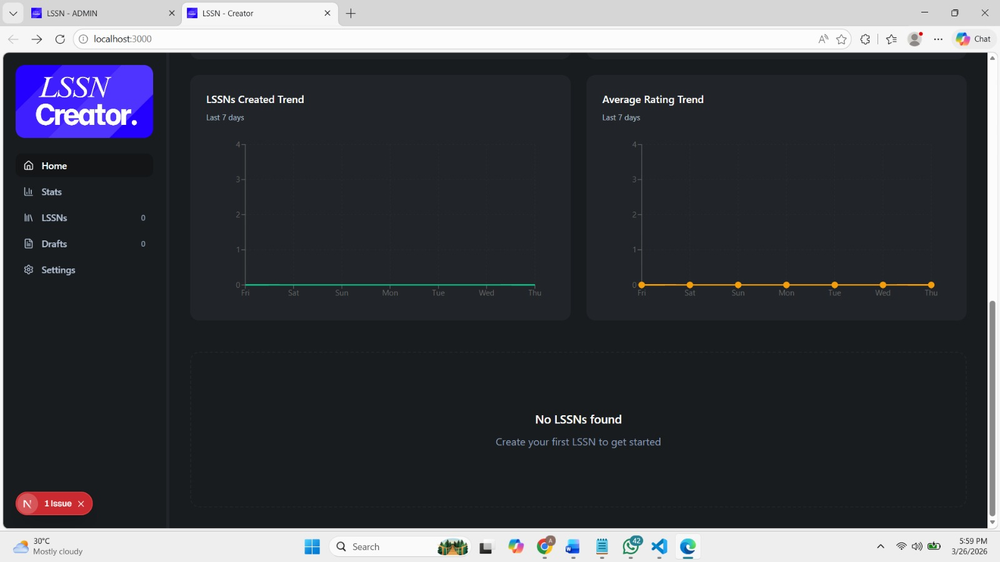
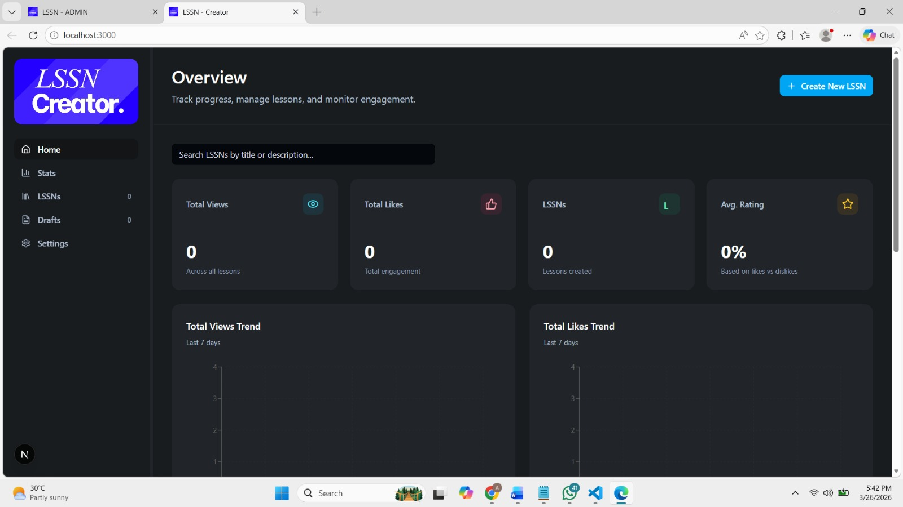

# LSSN Platform

LSSN is a purpose-built, role-driven learning ecosystem designed for modern education and content monetization. It is not a single app; it is a coordinated product suite with a mobile learner experience, a creator studio, an administration console, and a full TypeScript backend.

## Why this project is unique

- Centralized learning workflow: learners, content creators, and platform administrators all operate from a single engineered ecosystem rather than separate isolated demos.
- Content-first microlearning model: lessons are built as modular slide canvases, optimized for mobile consumption and creator reuse.
- Built for rapid scaling: the product supports draft publishing, performance analytics, content categorization, topic management, and secure user roles.
- Modern real-world infrastructure: the stack is ready for production with a robust backend, type-safe APIs, and a consistent developer toolchain.

## Product components

### 1. Mobile Learner Application (`development/source/lssn_app`)

- Built with Expo and React Native to deliver a native-grade mobile experience.
- Learners can browse published lessons, open vertical slide-based content, and react to individual slides.
- The viewer renders rich lesson cards dynamically from the backend content schema, supporting text, images, and canvas-like visual layouts.
- Local token storage and secure API integration deliver a polished mobile access flow.

### 2. Creator Studio (`development/source/lssn_creator`)

- Built with Next.js 16 and React 19 to serve as a premium web production workspace.
- Creators have a polished dashboard for drafts, published lessons, search, and metrics.
- The design supports fast authoring, status management, and real-time content visibility.
- The creator experience is optimized for building reusable lesson assets and understanding audience engagement.

### 3. Administration Console (`development/source/lssn_admin`)

- Built in Next.js 16 with enterprise-grade UI primitives.
- Admins can manage users, lesson lifecycle, categories, and topics.
- Includes moderation controls, role upgrades, content approvals, and upload workflows.
- The console is built to support governance for a multi-tenant education or training platform.

### 4. Backend API (`development/source/lssn_server`)

- Built with NestJS 11 and TypeScript for scalable server-side architecture.
- Uses JWT-based authentication, Passport, class-validator, and global validation pipes.
- Drizzle ORM and `pg` provide a modern type-safe Postgres persistence layer.
- Designed to support secure content operations, admin routes, creator metrics, and lesson rendering.

## Technology choices and how they are used

### Frontend and mobile

- **Expo / React Native**: enables cross-platform mobile rollout while preserving native responsiveness.
- **React Navigation**: used for fluid mobile learner flows and screen transitions.
- **Zustand**: lightweight state management for application state and user session control.
- **AsyncStorage**: secure storage for access and refresh tokens on mobile.
- **Next.js 16**: powers both creator and admin studios with server-rendered and client-rich pages.
- **Radix UI**: provides accessible, low-level UI building blocks for a high-quality studio interface.
- **Tailwind CSS 4**: offers consistent, production-ready styling across web surfaces.
- **react-hook-form / zod**: ensure fast, validated input flows for creators and administrators.
- **Recharts**: exposes creator and admin analytics through charts and engagement metrics.

### Backend and data

- **NestJS**: architecture with modular controllers, providers, and middleware for maintainability.
- **Drizzle ORM**: enables type-safe SQL and schema management for Postgres.
- **Passport + JWT**: secures authentication across public, creator, and admin boundaries.
- **class-validator / class-transformer**: protects every request with strong DTO validation.
- **Postgres**: the backend data store of choice for content, users, categories, and activity tracking.
- **dotenv**: supports clear environment configuration across development and production.

## Strategic decisions and business advantages

- **Multi-role product positioning**: the same platform serves learners, creators, and administrators, enabling both B2C and B2B business models.
- **Creator analytics from day one**: creator dashboards report total views, likes, average rating, and draft counts to drive retention and monetization.
- **Admin governance layer**: built-in admin tools make the product investment-ready for regulated markets, course marketplaces, and enterprise training.
- **Content lifecycle control**: the workflow supports drafts, published lessons, categories, topics, and interactive engagement metrics.
- **Mobile-first learning format**: the learning experience is designed for on-the-go consumption and simple interaction, with vertical slide navigation and reactions.
- **Future-ready architecture**: clear separation of concerns between mobile, web, and server layers allows future extension into subscription services, AI-assisted authoring, and multi-tenant operations.

## Screenshots and product visuals

### Learner authentication and onboarding







### Creator studio and content production





### Admin governance and analytics







### Mobile engagement and content consumption





## Getting started

### 1. Install dependencies

Each package has its own dependency set.

- `development/source/lssn_app`
- `development/source/lssn_creator`
- `development/source/lssn_admin`
- `development/source/lssn_server`

Example:

```bash
cd development/source/lssn_server
npm install

cd ../lssn_creator
npm install

cd ../lssn_admin
npm install

cd ../lssn_app
npm install
```

### 2. Run the backend

```bash
cd development/source/lssn_server
npm run start:dev
```

### 3. Run the creator studio

```bash
cd development/source/lssn_creator
npm run dev
```

### 4. Run the admin console

```bash
cd development/source/lssn_admin
npm run dev
```

### 5. Run the mobile app

```bash
cd development/source/lssn_app
npm run start
```

## Why investors should care

This project is not a proof-of-concept. It is a complete learning platform engineered for fast expansion into creator monetization, course marketplaces, enterprise training, and interactive microlearning. The multi-interface approach and modern architecture make it a strong foundation for an MVP that can convert early adopter traction into recurring revenue.

- Strong product differentiation through role-based workflows
- Clear monetization pathways via creators and admins
- Enterprise-ready admin controls and analytics
- Modern stack that supports rapid iteration and deployment

## Project structure

- `development/source/lssn_app` - mobile learner app built with Expo React Native
- `development/source/lssn_creator` - creator studio built with Next.js
- `development/source/lssn_admin` - administration console built with Next.js
- `development/source/lssn_server` - backend API and data services built with NestJS

## Next steps for scaling

- Add subscription and payment integration for creators
- Build AI-assisted content generation and summarization
- Add multi-tenant support for organizations and schools
- Expand lesson analytics to session-level funnels and cohort performance

This README captures the product direction, technical differentiation, and investor-ready value proposition for the LSSN platform.
